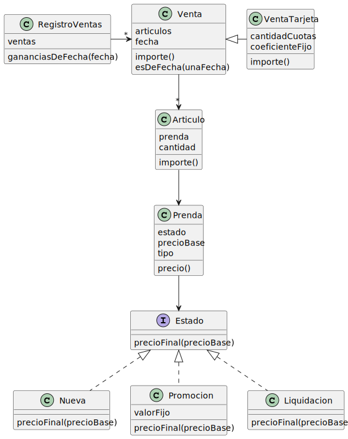

# **Ejercicio de Clase** - Ignacio Ardanaz - Maco Wins

~~**Terminado**.~~

Enunciado [acá](https://docs.google.com/document/d/1mjWKl9YH9Bb39iIUl1bQj_xhx_-CjCAMpcAXRqKhVjU/edit#)

## **Requerimientos**:
* Conocer el precio de una prenda.
* Conocer el tipo de una prenda.
* Registrar una venta.
* Conocer las ganancias de un día.
## **Diagrama de Clases**:
